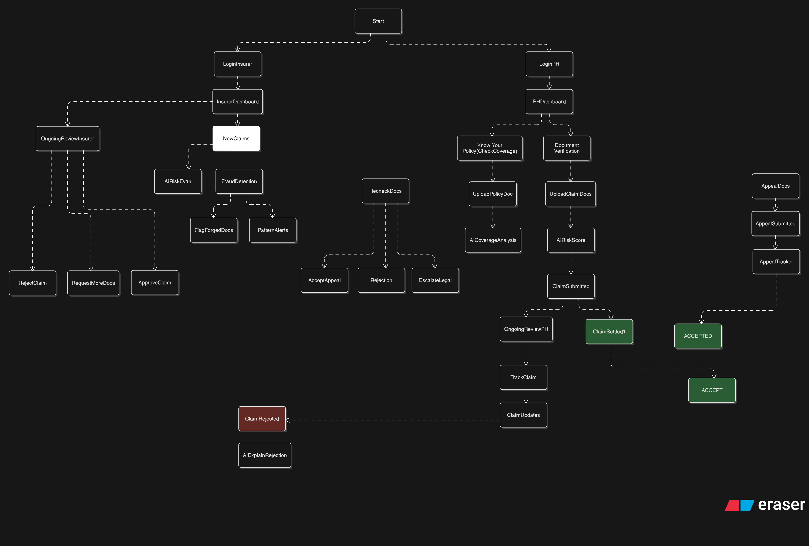
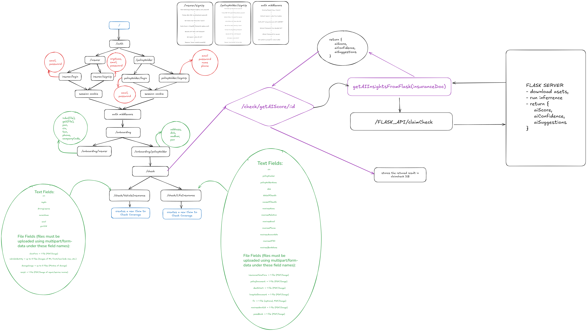

# InsureSaathi.ai

## AI-Powered Insurance Claim Intelligence Platform

**InsureSaathi.ai** is an AI-driven platform focused on life insurance claim processing in India. Built with machine learning and aligned with IRDAI regulatory frameworks, it delivers automated, fraud-resistant, and intelligent workflows to enhance accuracy, speed, and trust for both policyholders and insurers.

---

## 🧩 Architecture Overview

This repository is a **full-stack monorepo** with:

- `frontend/` – React + TypeScript + Vite single-page application for policyholders and insurers.
- `backend/` – Node.js/Express REST API for authentication, onboarding, claims, and insurer workflows.
- `pythonApi/` – Python/Flask microservice for ML-based fraud/risk prediction.

High-level architecture:



Backend workflow overview:



---

## 🧾 Problem Statement

The Indian insurance landscape grapples with claim processing delays, fraudulent submissions, and opaque practices. Policyholders face unclear coverage details, while insurers lose crores due to falsified documents and inflated claims. InsureSaathi.ai automates validation and settlement, ensuring precision, transparency, and auditability across the claim lifecycle.

### Insurance Domains Covered

#### Life Insurance

Focus on document compliance and death-claim verification:

- **Policy Verification**
  - Validates UIN, coverage, term, and issuer against IRDAI registry and master policy data.
- **Death Certificate Verification**
  - OCR extracts name, date, and place; cross-matches with other submitted documents.
  - NLP-based checks highlight inconsistencies, missing data, or suspicious patterns.

---

## 🧠 Machine Learning Microservice (`pythonApi/`)

A dedicated **Python/Flask** service (in `pythonApi/`) hosts the machine-learning models used by the platform. It exposes a simple REST API that the Node.js backend calls over HTTP (port `5000` by default) for:

- **Life insurance fraud prediction** based on structured claim features.
- Extensible hooks for future risk evaluation and document/image models.

For detailed environment, dependencies, and endpoint documentation, see `pythonApi/README.md`.

---

## 🤖 Backend Service (`backend/`)

The **Node.js/Express** backend powers:

- Authentication for **policyholders** and **insurers**.
- Onboarding flows with document collection and verification.
- Life insurance coverage checks and claim submission.
- Insurer dashboards for:
  - Fetching and reviewing claims.
  - Viewing AI fraud reports and uploaded documents.
  - Approving, rejecting, or marking claims for review.
- Integration with the Python ML service and Cloudinary for file storage.

Key technologies:

- **Runtime**: Node.js (ES modules).
- **Framework**: Express.js.
- **Database**: MongoDB with Mongoose ODM.
- **Auth**: JWT, Firebase/Firebase Admin.
- **Storage**: Cloudinary + local `uploads/` staging.

Full API reference, environment variables, CORS configuration, and deployment details are documented in `backend/README.md`.

---

## 🎨 Frontend Application (`frontend/`)

The **React + TypeScript + Vite** SPA provides separate experiences for:

- **Policyholders** – authentication, onboarding, claim creation, and claim status tracking.
- **Insurers** – login, claim queues, document previews, AI score inspection, and decisioning.

Key technologies:

- **Framework**: React 19 with React Router.
- **Language**: TypeScript.
- **Styling**: Tailwind CSS + utility components (Radix UI, shadcn-style primitives).
- **Build**: Vite with modern ES module toolchain.

Refer to `frontend/README.md` (and inline comments in `src/`) for page-level structure and component usage.

---

## 🧪 AI Models & Analytics

The ML layer focuses on:

| **Use Case**             | **Model / Technique**                                  | **Description**                                             |
|--------------------------|--------------------------------------------------------|-------------------------------------------------------------|
| Life-claim fraud scoring | Scikit-learn model (`life_insurance_fraud_model.pkl`) | Scores likelihood of fraud based on claim features.        |
| Document OCR             | Tesseract OCR + PDF tools                              | Extracts and normalizes policy and supporting-document text.|
| Vision / forgery (WIP)   | YOLO / CV pipelines (future extension)                 | Intended for tampered-doc and anomaly detection.           |
| Explanation layer        | LLM + rules engine (future extension)                  | Human-readable explanations for approvals/rejections.      |

Additional analytics assets (e.g. confusion matrices) are stored as images such as `Confusion_Matrix.png`.

---

## ✨ Core Features

- **Intelligent Risk Scoring** – Real-time assessment of claim legitimacy.
- **Document & Forgery Checks** – Validation of submitted PDFs and images.
- **Coverage & Compliance** – Cross-checks with policy data and IRDAI requirements.
- **Transparent Decisions** – Clear feedback for approvals/rejections (extensible with LLMs).
- **Dashboards for Stakeholders** – Tailored views for policyholders and insurers.
- **Regulatory Audit Trail** – End-to-end traceability of decisions and data.

---

## 🛠 Technology Stack (Monorepo)

- **Frontend**: React, TypeScript, Tailwind CSS, Vite.
- **Backend**: Node.js, Express.js, MongoDB (Mongoose), JWT, Firebase, Cloudinary, Multer.
- **ML Service**: Python, Flask, scikit-learn, Tesseract OCR, PDF tooling, and supporting ML/vision libraries.
- **Infrastructure**:
  - RESTful backend (`backend/`) calling out to `pythonApi/`.
  - Environment-driven configuration via `.env` files.
  - Designed for deployment to services like Vercel (backend/frontend) and a separate Python host.

---

## 🚀 Local Development Setup

> You can run each service independently. The typical local setup uses:
> - Backend on `http://localhost:3000`
> - Python ML service on `http://localhost:5000`
> - Frontend on `http://localhost:5173`

### 1. Clone the repository

```bash
git clone <your-repo-url>
cd InsuranceSaathi.ai-main
```

### 2. Backend (Node/Express)

```bash
cd backend
npm install
```

Create a `.env` file (see `backend/README.md` for the full list). Minimum example:

```env
PORT=3000
MONGO_URL=your_mongodb_connection_string
JWT_SECRET=your_jwt_secret
CLOUDINARY_CLOUD_NAME=your_cloudinary_cloud_name
CLOUDINARY_API_KEY=your_cloudinary_api_key
CLOUDINARY_API_SECRET=your_cloudinary_api_secret
```

Run the backend:

```bash
npm start
```

### 3. Python ML Microservice

```bash
cd ../pythonApi
python -m venv venv
```

Activate the virtual environment, then:

```bash
pip install --upgrade pip setuptools wheel
pip install -r requirements.txt
```

Ensure the model file `life_insurance_fraud_model.pkl` is present in `pythonApi/`, then:

```bash
python api.py
```

For Tesseract and detailed setup, see `pythonApi/README.md`.

### 4. Frontend (React/Vite)

```bash
cd ../frontend
npm install
npm run dev
```

By default Vite runs on `http://localhost:5173`. Configure base URLs in the frontend (e.g. via environment variables) to point to your backend (`3000`) and ML service (`5000`).

---

## 📂 Repository Structure

```text
.
├── backend/       # Node.js/Express API (claims, auth, insurer workflows)
├── frontend/      # React + TS + Vite SPA
├── pythonApi/     # Python/Flask ML inference service
├── architecture.png
├── backend_structure.png
├── Confusion_Matrix.png
├── LICENSE
└── README.md
```

For deeper details:

- Backend: `backend/README.md`
- Python ML service: `pythonApi/README.md`
- Frontend: `frontend/README.md` (plus code comments and routes)

---

## 🌟 Vision

Building India’s most intelligent, transparent, and trusted claim-processing engine for life insurance. InsureSaathi.ai is designed as a **living ecosystem** that can evolve to include:

- Advanced reinforcement-learning–driven risk and pricing models.
- Immutable audit trails via blockchain-style ledgers.
- Natural-language and voice-driven claim submissions.
- IoT and external data integrations for richer risk assessment.

---

## 📜 License

This project is licensed under the **MIT License**.  
See [`LICENSE`](LICENSE) for full text.

---

## 🙌 Acknowledgments

Crafted with passion by the InsureSaathi.ai team for a fraud-free insurance future.

